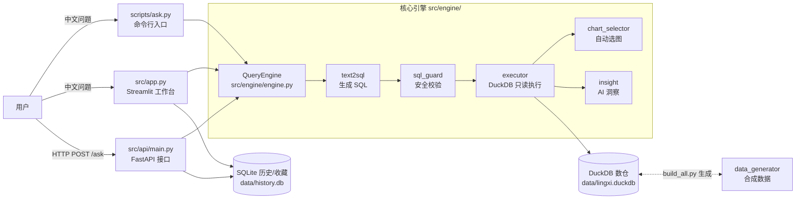

# ⚙️ 宁波鲍斯能源装备 · 智能问数平台（灵犀 Lingxi）

一个**成品级**的 AI 智能问数（Text-to-SQL）项目：用中文自然语言提问，系统自动
生成 SQL → 查询 DuckDB 数仓 → 自动选图 → 给出 AI 洞察，并提供 FastAPI 接口与
Streamlit 可视化工作台。

> 适合作为「AI 应用开发 / 大模型工程 / 数据分析」方向的面试演示与简历项目。

---

## ✨ 核心能力

| 能力 | 说明 |
| --- | --- |
| 🧠 中文问数 | 输入「2026 年 3 月各产品销售额是多少？」，自动生成 DuckDB SQL 并执行 |
| 🔒 SQL 安全 | 执行前拦截非 SELECT、多语句、表/字段白名单、强制 LIMIT 1000 |
| 🔁 失败自愈 | SQL 执行报错时自动把错误反馈给 LLM 修正一次 |
| 🛡️ 离线降级 | 无 API Key 或 `ENABLE_MOCK=true` 时用规则生成 SQL，保证可离线演示 |
| 📊 自动选图 | 指标卡 / 折线图 / 柱状图 / 饼图 / 表格，按结果结构规则选图 |
| 🧩 AI 洞察 | 基于**真实返回数据**生成洞察，严禁编造 |
| 🌐 API + 前端 | FastAPI REST 接口 + Streamlit 工作台 + SQLite 历史/收藏 |
| 📐 可评测 | 内置 18 条评测集与 `scripts/eval.py`，可量化生成质量 |

---

## 🏗️ 架构



**数据流**：中文问题 → 生成 SQL（LLM，带 schema + few-shot）→ SQL 安全校验 →
只读执行（失败自动修正一次）→ 自动选图 + AI 洞察 → 统一 `Answer` 模型返回。

---

## 📂 目录结构

```
lingxi/
├── src/                          # 主包
│   ├── config.py                 # 路径 / 随机种子 / 模型配置
│   ├── schema.py                 # 6 张表 schema（单一数据源，喂给 prompt）
│   ├── data_generator.py         # 合成数据生成（固定随机种子，可复现）
│   ├── warehouse.py              # DuckDB 建表 + 灌数 + 校验摘要
│   ├── eval_cases.py             # 评测集（18 条）+ 结果比对逻辑
│   ├── history.py                # SQLite 历史记录 / 收藏
│   ├── app.py                    # Streamlit 工作台
│   ├── api/
│   │   └── main.py               # FastAPI 接口
│   └── engine/                   # 核心引擎
│       ├── engine.py             # 引擎门面：QueryEngine.ask()
│       ├── text2sql.py           # SQL 生成 + mock 降级 + 失败修正
│       ├── sql_guard.py          # SQL 安全校验（白名单 / LIMIT）
│       ├── executor.py           # DuckDB 只读执行（QueryResult 模型）
│       ├── chart_selector.py     # 规则自动选图（ChartConfig 模型）
│       ├── insight.py            # AI 洞察生成
│       ├── prompts.py            # prompt 构造（schema + few-shot）
│       ├── few_shots.py          # 8 条 few-shot 示例
│       └── llm_client.py         # OpenAI 兼容接口 HTTP 客户端
├── scripts/
│   ├── build_all.py              # 一键：生成数据 + 建库灌数 + 校验
│   ├── ask.py                    # 命令行问数入口
│   ├── eval.py                   # 批量评测脚本
│   └── start_all.py              # 一键启动 API + Streamlit
├── tests/
│   ├── test_sql_guard.py         # SQL 安全校验（22 例）
│   ├── test_chart_selector.py    # 自动选图（9 例）
│   └── test_eval_cases.py        # 评测集 + 比对逻辑（18 例）
├── docs/
│   └── schema.md                 # schema 权威中文文档
├── reports/
│   └── eval_report.json          # 评测报告（真实大模型跑出的结果）
├── data/                         # 生成产物（.gitignore 排除）
│   ├── lingxi.duckdb             # DuckDB 数仓
│   ├── history.db                # 历史/收藏
│   └── csv/                      # 原始 CSV
├── requirements.txt              # 依赖清单（与 pyproject.toml 并存）
├── pyproject.toml                # 项目元数据 + pytest/ruff 配置
├── .env.example                  # 环境变量模板
└── README.md
```

---

## 🚀 快速开始

### 1. 安装依赖

```bash
# 方式一（推荐）：用 pyproject.toml 安装
pip install -e ".[dev]"

# 方式二：传统 requirements.txt（与 pyproject.toml 依赖保持一致）
pip install -r requirements.txt
```

### 2. 配置大模型（可选，不配则走 mock）

```bash
# 复制模板并填入真实 key
cp .env.example .env
# 编辑 .env：
#   API_KEY=sk-xxxx
#   MODEL_PROVIDER=deepseek
#   MODEL_NAME=deepseek-v4-pro
#   BASE_URL=https://api.deepseek.com/v1
```

### 3. 一键构建数仓（生成数据 + 建库 + 校验）

```bash
python scripts/build_all.py
```

### 4. 命令行问数

```bash
# 真实大模型
python scripts/ask.py "华东地区的销售额是多少"

# 强制离线 mock（无网络也能跑）
$env:ENABLE_MOCK="true"; python scripts/ask.py "各区域的销售额是多少"
```

### 5. 启动工作台（API + Streamlit）

```bash
python scripts/start_all.py
# 启动后自动打开浏览器：
#   API      http://127.0.0.1:8000/docs
#   工作台    http://localhost:8501
```

---

## 🔌 API 端点

| 方法 | 路径 | 说明 |
| --- | --- | --- |
| `GET` | `/health` | 健康检查 + 数仓就绪状态 |
| `GET` | `/schema` | 数据字典（6 张表 + 字段中文说明） |
| `POST` | `/ask` | 中文问数 `{"question": "..."}` |
| `GET` | `/history` | 历史记录（`?favorite_only=true` 只看收藏） |
| `GET` | `/history/{id}` | 单条历史详情 |
| `POST` | `/history/{id}/favorite` | 收藏 / 取消收藏 |
| `DELETE` | `/history/{id}` | 删除一条历史 |

> 约定：`/ask` 永不抛 500，引擎错误统一落到 `Answer.error` 字段，HTTP 恒返回 200。

---

## 📊 评测

### 评测集

`src/eval_cases.py` 内置 **18 条**中文问数，覆盖：

- 求和、平均、同比环比
- 分组、排序、TopN
- 时间范围、条件过滤、多表关联

每条含「问题 + 参考答案（关键指标值）+ 参考答案 SQL」，参考答案基于
`docs/schema.md` 与真实数仓数据，**有明确可验证答案**。

### 跑评测

```bash
# 真实大模型评测（需 .env 配好 key）
python scripts/eval.py

# 离线 mock 评测（无需网络）
python scripts/eval.py --mock
```

报告输出到 `reports/eval_report.json`，含每条用例的「问题 / 生成 SQL / 执行结果 / 是否命中 / 错误信息」。

### 评测结果（真实大模型 deepseek-v4-pro，18 条）

| 指标 | 数值 |
| --- | --- |
| SQL 执行成功率 | **100.0%**（18/18） |
| 结果准确率 | **100.0%**（18/18） |
| 相对成功执行准确率 | 100.0% |

| 编号 | 问题 | 能力 | 命中 |
| --- | --- | --- | --- |
| E01 | 全年总销售额是多少？ | 求和 | ✅ |
| E02 | 压缩机类产品的销售额是多少？ | 求和/条件过滤/多表关联 | ✅ |
| E03 | 平均每天的销售额是多少？ | 平均 | ✅ |
| E04 | 各区域的销售额分别是多少？ | 分组/多表关联 | ✅ |
| E05 | 各产品类别的销售额分别是多少？ | 分组/多表关联 | ✅ |
| E06 | 销售额最高的5个产品是哪些？ | 排序/TopN/多表关联 | ✅ |
| E07 | 2026年上半年每个月的销售额趋势？ | 时间范围/分组 | ✅ |
| E08 | 2026年2月和3月的销售额（环比对比）？ | 同比环比/时间范围 | ✅ |
| E09 | 各产品的缺陷率是多少？ | 分组/多表关联 | ✅ |
| E10 | 华东地区的销售额是多少？ | 条件过滤/多表关联 | ✅ |
| E11 | 整体毛利率是多少？ | 求和 | ✅ |
| E12 | 各区域的销售数量分别是多少？ | 分组/多表关联 | ✅ |
| E13 | 销售额最高的5个客户是哪些？ | 排序/TopN/多表关联 | ✅ |
| E14 | 2026年1月的销售额是多少？ | 时间范围/条件过滤 | ✅ |
| E15 | 2026年上半年每个月的产量达成率？ | 时间范围/分组/多表关联 | ✅ |
| E16 | 精密件类产品的销售额是多少？ | 条件过滤/多表关联 | ✅ |
| E17 | 单笔销售金额最高是多少？ | 排序 | ✅ |
| E18 | 大客户的销售额占总销售额的比例是多少？ | 条件过滤/多表关联/求和 | ✅ |

> 比对口径：数值按「相对 1% + 绝对 0.01」容差，分组/TopN/时间序列做集合或顺序比对。

---

## 🧪 测试与代码质量

```bash
# 单元测试（含评测集相关 18 例，共 49 例）
python -m pytest -q

# 代码规范检查
python -m ruff check .
```

---

## 🔧 环境变量

| 变量 | 说明 | 默认值 |
| --- | --- | --- |
| `MODEL_PROVIDER` | 模型供应商标识 | `deepseek` |
| `MODEL_NAME` | 模型名称 | `deepseek-v4-pro` |
| `API_KEY` | 大模型 API Key（必填，否则走 mock） | 空 |
| `BASE_URL` | OpenAI 兼容接口地址 | `https://api.deepseek.com/v1` |
| `REQUEST_TIMEOUT` | 请求超时（秒） | `60` |
| `MAX_RETRIES` | 最大重试次数 | `1` |
| `ENABLE_MOCK` | 是否强制 mock 降级（`true`/`false`） | `false` |

---

## 📐 数据模型（星型模型，6 张表）

| 表 | 说明 | 关键字段 |
| --- | --- | --- |
| `dim_product` | 产品维 | product_id, product_name, category(压缩机/真空设备/液压件/精密件), unit_price |
| `dim_region` | 区域维 | region_id, region_name(华东/华南/华北/西南), province |
| `dim_customer` | 客户维 | customer_id, customer_name, tier(大客户/中小客户), industry |
| `fact_sales` | 销售事实 | sale_date, product_id, region_id, customer_id, quantity, amount, cost |
| `fact_quality` | 质检事实 | check_date, product_id, line, checked_count, defect_count |
| `fact_production` | 生产事实 | prod_date, product_id, line, planned_qty, actual_qty, downtime_hours |

**数据特征**（面试演示关键）：

- 日期范围 2025-09-01 ~ 2026-08-31（12 个月，固定随机种子 `20240916` 可复现）
- 区域差异：华东 > 华南 > 华北 > 西南
- 整体销售逐月增长 + 季节性波动
- 良率异常：精密齿轮轴(P006)/产线3 在 2026-03~05 缺陷率异常偏高（约 11%，正常约 2.5%），
  适合演示 AI 洞察「发现异常点」

---

## 🛠️ 技术栈

Python 3.11 · DuckDB · Pydantic · FastAPI · Streamlit · Plotly · pytest · Ruff

---

## 📄 关于依赖管理

项目同时保留 `requirements.txt` 与 `pyproject.toml`：

- **`pyproject.toml`** 为唯一真源：包含项目元数据、`[project]` 依赖、`[tool.pytest]`、`[tool.ruff]` 配置。
- **`requirements.txt`** 同步维护（供习惯 `pip install -r` 的用户使用），两处依赖清单保持一致。

---

## 🙋 常见问题

**Q：没有 API Key 能演示吗？**
能。不配 `.env` 或设 `ENABLE_MOCK=true` 会走 mock 规则生成 SQL，离线也能跑通全流程。

**Q：Windows 终端中文乱码？**
所有脚本入口已统一 `sys.stdout.reconfigure(encoding="utf-8")`；也可在运行前
设置 `$env:PYTHONUTF8="1"` 双保险。
